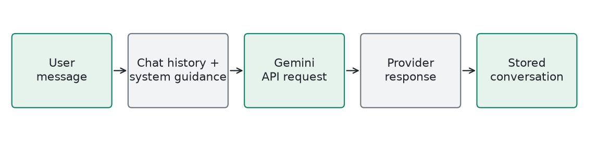

# AI Coach / Conversation

**External Gemini model through a PHP API wrapper** | Generated 2026-10-09 UTC

## How It Works

Send conversation history and coaching instructions to Gemini using a server-side environment key. Display the provider response and store chat history. The chat instructions reserve workouts, meals, and video analysis for the dedicated local modules.

## Training

No local model training or fine-tuning. GEMINI_MODEL chooses the provider model. A model-name alias may change over time; it is not a reproducible locally trained artifact.

## Evidence

Requires configured credentials and network access. This report does not make a live Gemini call or claim an evaluated coaching accuracy. Credentials are excluded from Git and the report.

## Example

A question about staying consistent is sent as conversational context. Full workout generation remains TrainCore's responsibility; NutriCore owns meal plans, and PoseForm owns recorded-video analysis.

## Limits

Provider responses can be incorrect or inappropriate. Conversation content is transmitted to an external service. Use privacy-aware inputs and do not treat chat as medical diagnosis.

## Source

backend/controllers/AIChatController.php; backend/services/GeminiService.php
