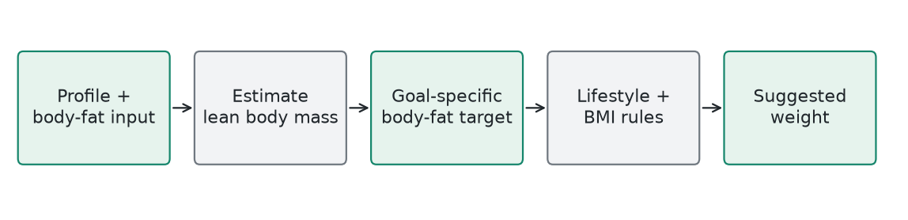

# GoalAI / Suggested Goal Weight

**Explicit body-composition heuristics** | Generated 2026-10-09 UTC

## How It Works

Estimate lean body mass from weight and supplied or heuristically estimated body fat. Compute a suggested weight for a fixed goal-specific body-fat percentage, apply small lifestyle adjustments, then apply BMI-related safeguards. No neural network or Random Forest is used.

## Training

Not applicable. The body-fat estimates, targets, and adjustments are hand-written formulas, not learned parameters.

## Evidence

No independent validation of goal-weight accuracy is available. Reported values describe the current code, not professional recommendations.

## Example

Illustrative intermediate calculation: 80 kg at 25% body fat implies 60 kg lean mass. A hypothetical 20% target gives 60 / 0.8 = 75 kg before adjustments. That target is an illustration, not an actual recommendation for a user.

## Limits

Waist-only estimates and default body-fat assumptions can be inaccurate. Fixed body-fat targets and BMI rules require professional review before presenting them as health-optimal goals. The app's suggested weight is not a clinical prescription.

## Source

backend/services/GoalAI.php
