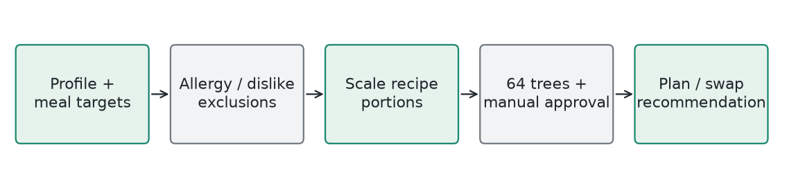
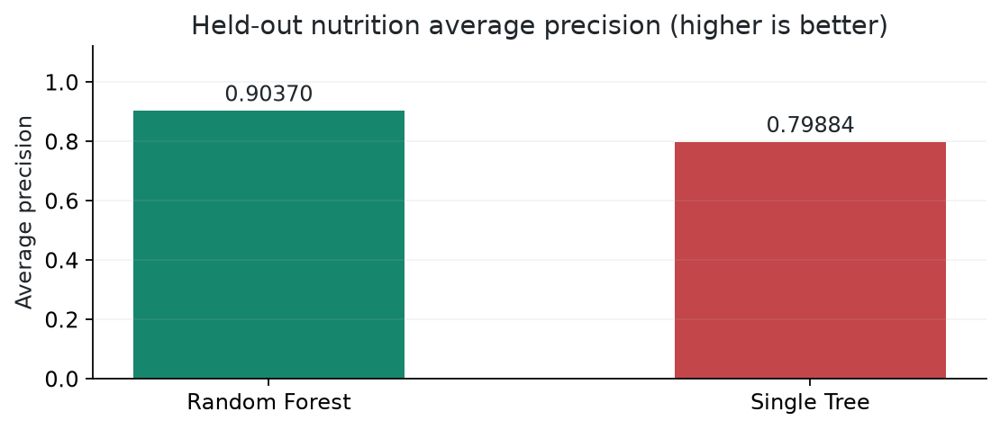

# NutriCore / Meals And Fridge Swaps

**Local Random Forest classifier** | Generated 2026-10-09 UTC

## How It Works

Preprocess complete USDA nutrient records into 72 recipes. Scale portions within 0.5x-2x, keeping ingredient grams and nutrients consistent. Trees compare macro, goal, fridge, and preference fit. Only manually approved options can be shown. Small macro bonuses, feedback, and variety adjustments influence final ranking; duplicate aliases are suppressed.

## Training

39,481 rule-derived examples over 600 scenarios. Split scenarios 60/20/20 for fitting, development, and test; select settings on development only, then refit on fitting plus development. Tied rubric scores receive consistent labels, and identical recipes share training weight.

## Evidence

Held-out average precision: 0.9037; baseline: 0.79884. Top-three rule-label hit rate: 98.84% over 431 eligible test slots. Human training ratings currently available: 0.

## Example

Illustrative: with a 2,200-calorie daily target and four meals, lunch receives 30%, or 660 calories. A 550-calorie recipe scales by 1.2. A base 40 g protein becomes 48 g. Milk-containing options are excluded for a recorded dairy allergy. An unapproved recipe is excluded even with a high score.

## Limits

Scores are relative suitability, not health probabilities. Existing recipe approval is not expert validation of every personalized portion. Gram instructions state raw/dry, cooked, drained, or as-sold weight. Ingredient records do not guarantee absence of allergen cross-contact. Macro totals alone do not establish fibre, sodium, or micronutrient adequacy.

## Source

ml/nutrition_ai/nutricore_model.py; train_model.py; MODEL_REPORT.md; REVIEW_GUIDE.md
