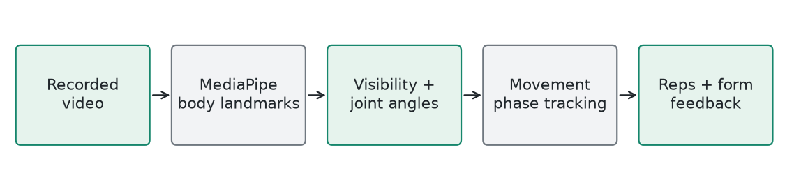

# PoseForm / Exercise Video

**Pretrained MediaPipe plus explicit movement rules** | Generated 2026-10-09 UTC

## How It Works

Read video frames and locate body joints with pretrained MediaPipe. Compute joint angles and select the more visible side. Exercise-specific start/end phases, range checks, and visibility thresholds determine repetitions and form feedback. This module still uses a neural pose detector; it was not replaced or retrained.

## Training

No local neural-network training. The supplied MediaPipe model is already trained. Local pose templates and movement rules are validated using synthetic pose sequences and exercise aliases.

## Evidence

17 template/form tests, two JavaScript repetition/noise checks, and three Python analyzer suites pass. An uploaded-video smoke test processed 62 landmark frames across 24 exercise modes. Running all modes on one clip checks robustness, not accuracy for 24 different exercises.

## Example

Illustrative: a squat must complete the configured standing-to-lowered-to-standing sequence. Small jitter and incomplete movement should not count as a full repetition. If body landmarks are unclear, the analyzer requests a clearer recording rather than treating missing joints as valid movement.

## Limits

Camera angle, occlusion, lighting, frame skipping, exercise selection, and movement variation affect results. Labeled exercise videos are needed to measure rep-count and form accuracy independently.

## Source

ml/exercise_ai/video_pose_analyzer.py; poseform_pose_templates.json; scripts/validate-exercise-ai.js
