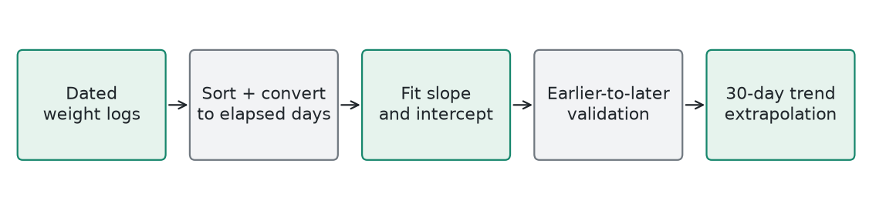
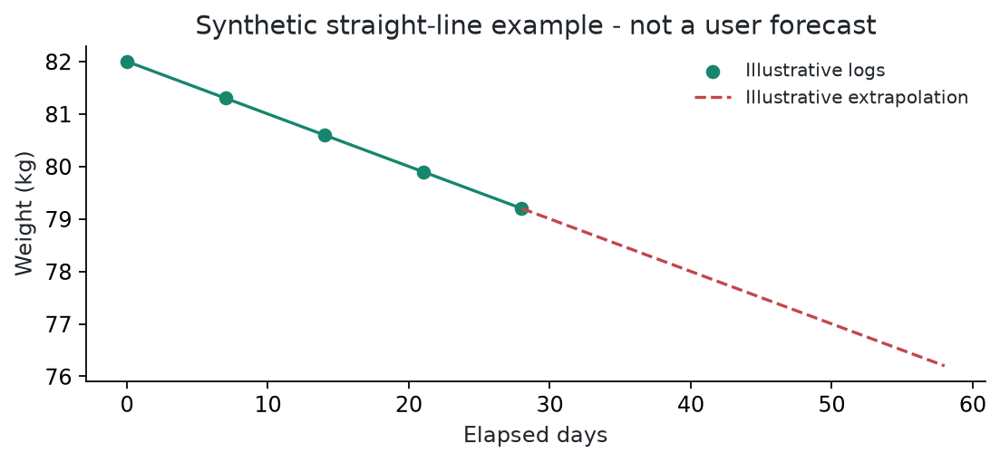

# PredictionAI / Weight Trend

**Local ordinary least-squares linear regression** | Generated 2026-10-09 UTC

## How It Works

Fit weight = intercept + slope x elapsed days. The slope describes average weight change per day. Fit the final trend to all available records and extrapolate 30 days beyond the latest observation. Refit for each user when requested; no shared model artifact needs offline training.

## Training

With at least four records and two distinct dates in the earlier training subset, hold out the latest 25% and predict those observations using only earlier data. Validation MAE is unavailable when there is insufficient data. Legacy training_accuracy is R-squared percentage, not classification accuracy.

## Evidence

The local validation script passes 10 cases covering exact lines, chronological error, ordering, insufficient data, and duplicate dates. A perfect score on a synthetic straight line is not real-world forecast accuracy.

## Example

Illustrative only: logs following weight = 82 - 0.1 x day have a slope of -0.1 kg/day. If the latest day is 28, a 30-day extension reaches day 58 and predicts 76.2 kg. This is mathematical extrapolation, not a promised outcome.

## Limits

Weight change is rarely linear indefinitely. Water fluctuations, sparse logs, changing behaviour, and medical factors can invalidate the forecast. It is a trend estimate, not a treatment or target-weight prescription.

## Source

backend/services/PredictionAI.php; scripts/test-prediction-ai.php
