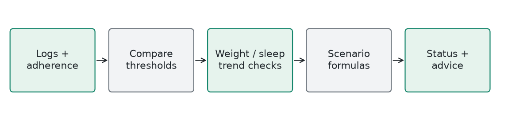

# ProgressAI / Progress And Scenarios

**Explicit PHP rules and heuristic simulation** | Generated 2026-10-09 UTC

## How It Works

Compare workout and nutrition adherence with explicit thresholds, inspect recent weight change, and generate predefined status and advice. Scenario simulation combines calorie delta, steps, sleep, and workout frequency using project formulas. There is no learned model or training file.

## Training

Not applicable. Rules are edited and tested as ordinary code; weights are not learned from examples.

## Evidence

This report describes the current source. The recommendation test suites do not independently validate ProgressAI's simulated health outcomes. No predictive accuracy is claimed.

## Example

With 50% workout adherence and 80% nutrition adherence, the audit reports Needs Attention because at least one adherence value is below 60%. Advice emphasizes consistency rather than adding extra training volume.

## Limits

Simulation constants and thresholds are project heuristics. They are not individualized physiology or clinical evidence, and status labels should not be treated as diagnoses.

## Source

backend/services/ProgressAI.php
