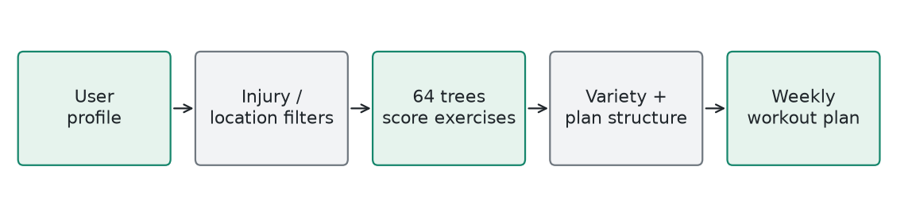
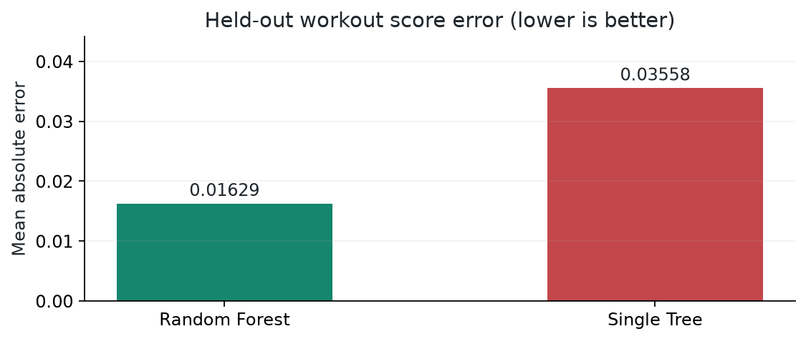

# TrainCore / Workout Recommendations

**Local Random Forest regressor** | Generated 2026-10-09 UTC

## How It Works

Encode goal, location, intensity, exercise category, movement family, and numeric fit features. Each trained tree predicts an exercise suitability score; average the 64 predictions. Hard restrictions and plan-building rules remain separate from the learned model.

## Training

Rule-derived profile/exercise examples: 25,408 training and 6,118 held out. Grouped profiles stay together. Compare the forest with a single-tree baseline. No feature scaling is required.

## Evidence

Held-out score MAE: 0.01629; single-tree baseline: 0.03558. The training pipeline generated and checked 3,960 profile plans. These are rule-agreement and structural checks, not clinical validation.

## Example

Illustrative: a home-training user with knee pain gets location- and injury-filtered candidates before scoring. A high model score cannot override those restrictions. The selected exercises are arranged into the requested weekly schedule.

## Limits

Rule-derived labels are not observed injury or fitness outcomes. The forest is easier to describe than a neural network, but 64 trees are less transparent than one tree. Check equipment availability and obtain appropriate professional advice for injuries.

## Source

ml/workout_ai/traincore_model.py; ml/workout_ai/traincore_trained_model.json
